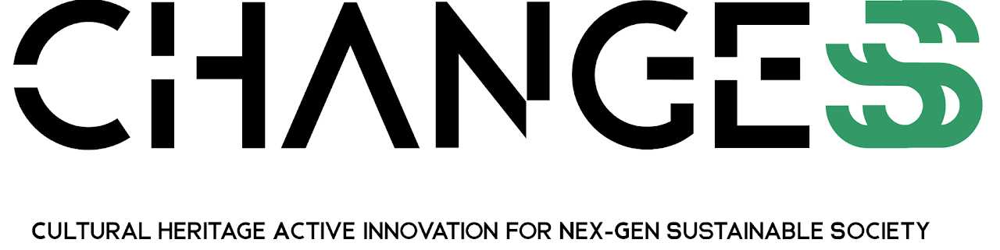
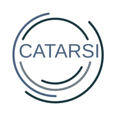

# Projects

This page lists some of the main projects and initiatives in which I am directly involved in.

  

  
  

  

    <a href="https://sites.google.com/uniroma1.it/changes/">PE5 – CHANGES "Cultural Heritage Active Innovation for Sustainable"</a> | 11 Universities, 4 Research Institutions, 3 Graduate Schools, 6 Companies, and 1 Center of Excellence: a multi-technological and transdisciplinary ecosystem for education, research, and technology transfer in the field of Humanities and Cultural Heritage. Furthermore, the specific project in question is SPOKE 4 - Virtual Technologies for Museums and Art Collections.
  

 

  

  
  

  

    <a href="https://opencitations.net">OpenCitations</a> | OpenCitations is a scholarly infrastructure organization dedicated to open scholarship and the publication of open bibliographic and citation data by the use of Semantic Web (Linked Data) technologies, and engaged in advocacy for semantic publishing and open citations. It has developed the OpenCitations Corpus (OCC) of open downloadable bibliographic and citation data recorded in RDF, and a system and resolution service for Open Citation Identifiers (OCIs), and it is currently developing a number of Open Citation Indexes using the data openly available in third-party bibliographic databases.
  

 

  

  
  

  

    <a href="https://www.openaire.eu/openaire-nexus-project">OpenAIRE Nexus</a> | OpenAIRE-Nexus brings in Europe, EOSC and the world a set of services to implement and accelerate Open Science. In particular, OpenAIRE-Nexus onboards to the EOSC fourteen services, provided by public institutions, einfrastructures, and companies, structured in three portfolios: PUBLISH, MONITOR and DISCOVER. The services are widely used in Europe and beyond and integrated in OpenAIRE-Nexus to assemble a uniform Open Science Scholarly Communication package for the EOSC.
  

 

  

    
  

  

  <a href="https://dl.ficlit.unibo.it/">Digital Library (FICLIT)</a> | The digital version (data and metadata) of cultural archives and collection held and maintained by the Department of Classical Philology and Italian Studies.
  

 

  

    
  

  

  <a href="https://catarsiproject.wordpress.com/">CATARSI</a> | The project CATARSI (Comprensione Automatica di Testi e ARticoli nelle scienze Sociali e Informatiche – automatic understanding of texts and articles in social sciences and computer sciences) aims at tackling the interface between social sciences and information science and improving both the knowledge and the development of computer based techniques for analyzing texts and extract meanings.  
  The issue tackled by CATARSI is cultural and practical, and its results will impact both on information science, which deals more with ontological aspects, and on social sciences, that can use new instruments to improve the way knowledge is analyzed and created.  
  CATARSI is a project funded the University of Bologna under the funding sheme ALMA IDEA linea giovani.
  

 

  

    
  

  

  <a href="https://raw.githubusercontent.com/catarsi/mitao">MITAO</a> | MITAO, a Mashup Interface for Text Analysis Operations, is an open source, user-friendly, modular, and flexible software written in Python and Javascript for performing several kinds of text analysis, and can be run locally on a machine by using any modern Web browser. Its source code and documentation is all available on its Github repository. It is licensed under the ISC License. This application is linked to the <a href="https://centri.unibo.it/dharc/en/research/projects-at-dh-arc#catarsi">CATARSI project</a>.
  

 

  

    
    
  

  

  <a href="https://raw.githubusercontent.com/opencitations/lucinda">OSCAR and LUCINDA</a> | OSCAR is a user friendly search platform applicable for any triplestore endpoint.
  Using OSCAR can work with any sparql endpoint by configuring a particular JSON document, which specifies how the SPARQL queries are sent to that endpoint, and how the returned query results should be visualized, according to the predefined tabular view that OSCAR provides. LUCINDA is a general RDF-resource browser which could be configured to work with any triplestore providing a SPARQL-endpoint address. LUCINDA can also integrate in it OSCAR, The OpenCitations RDF Search Application.
  

