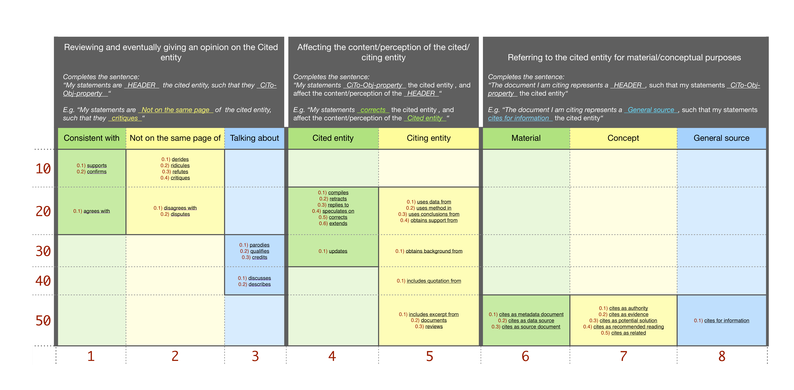

# 21 February 2020

##Talk with Silvio about
* I found this was an interesting thing to show: [https://www.ref-n-write.com/trial/research-paper-example-writing-literature-review-section-academic-phrasebank-vocabulary/](https://www.ref-n-write.com/trial/research-paper-example-writing-literature-review-section-academic-phrasebank-vocabulary/)  
* Silvio suggested me to move this research question: *“Can we apply our methodology, or a variation of it, to other cases (e.g. not retraction)?”* -> To the conclusion/future works section.

##Retraction analysis: new annotation model

##Catarsi Meeting and SAGE Grant submission
I have updated MITAO with a help/guideline section which users can also display from an online version at the online link: [http://163.172.159.152:5000/](http://163.172.159.152:5000/). In addition we now have a small documentation explaining MITAO, its main features and operations. I have also included a use-case example to apply directly on MITAO. [http://163.172.159.152/src/mitao/mitao_doc.pdf](http://163.172.159.152/src/mitao/mitao_doc.pdf).  
Finally, I have submitted the SAGE Grant application.

    

 