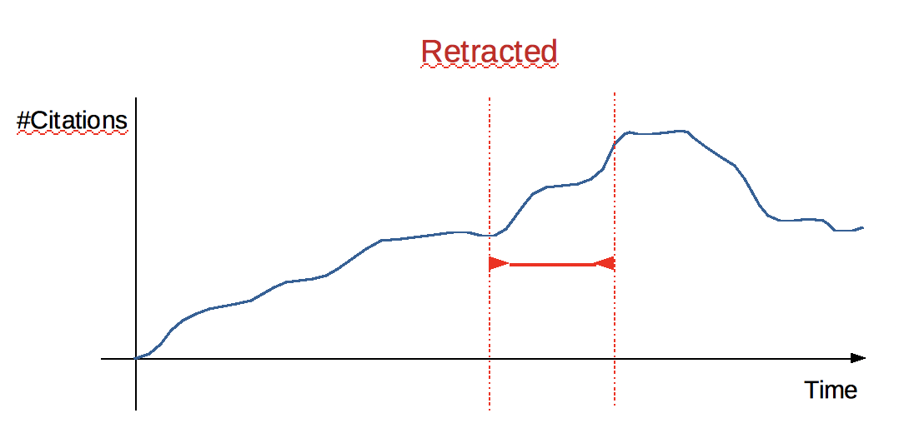

# 15 November 2019

***
##Meeting with Tommaso and Francesca

Things that I will look at:

* The MAG-XML for the provenance of the items
* Bulk-Import and Bulk-Import file. To insert a collection of files all together.
The current version of the add-on inserts all the elements as items. 

Francesca will take care of the “Model” part of the digital library project. This work will be fully independent from the work me and Tommaso are doing. The idea is to have as soon as possible a “Draft Model” which could be used to normalise the data we already have stored in Omeka-s.

##Authority combined with “Retraction”
On my last weekly meeting, Silvio pointed out a very interesting new prospective for the analysis of the question we raised last week regarding the “Authority” of an author over the time. The idea is to combine the “Authority” with the “Retraction” phenomena. 
In this case the “Retraction” will represent a turning point which could help us in the analysis of a pre and post situation and to establish/characterise some behaviours. The main idea is to combine citations quantitative studies with the “citation function” characterisation, and try to infer relevant information, e.g. how is the authority of a particular author is changing over the time, and what did actually happen to him after such turning point.
A good example is the “Vax” controversial article, which has been retracted at some point, but still other works keep citing it. So we might ask: why? And what are the reasons for citing it ?

This week I will try look at what have been already done by other works regarding:

* **“Retraction” phenomena from a quantitative and qualitative analysis.**
* **Did someone look at the “Reasons” on citing the retracted articles (after its actual retraction) ?**

###A must-read article: "Phenomena of Retraction: Reasons for Retraction and Citations to the Publications” [1]
This article summarises all the conversation me and Silvio had on the previous week meeting. Here I would like to write down some important notes I got from it.

* **An overview and the objectives:**  
This study examined the impact of retracted articles on biomedical communication. This work is based on MEDLINE from 1966 through August 1997 for articles that had been retracted. The main objective is to examine publications identified in the biomedical literature as having been retracted, to ascertain why and by whom the publications were retracted and to what extent citations of later-retracted articles continue to be incor- porated in subsequent work.
* **Measures and results:**  
The main measure taken in consideration is regarding the characteristics of retractions and citations to articles after retraction. The results of this work are based on a total of 235 articles had been retracted. Error was acknowledged in relation to 91 articles; results could not be replicated in 38; misconduct was evi- dent in 86; and no clear reason was given in 20. Of the 235 articles, 190 were re- tracted by some or all of the authors; 45 were retracted by a person or organization other than the author(s). The 235 retracted articles were cited 2034 times after the retraction notice. Examination of 299 of those citations reveals that in only 19 in- stances was the retraction noted; the remaining 280 citations treated the retracted article either explicitly (n = 17) or implicitly (n = 263) as though it were valid research.
* **Work conclusions:**  
Retracted articles continue to be cited as valid work in the biomedical literature after publication of the retraction; these citations signal potential problems for biomedical science.

### Post retraction citations in context: a case study [2]
* **An overview:**  
"This study examines the nature of citations to articles that were retracted in 2014. Out of 987 retracted articles found in ScienceDirect, an Elsevier full text database, we selected all articles that received more than 10 citations between January 2015 and March 2016." 
* **Measures and results:**  
"Overall, we analyzed 238 citing documents and identified the context of each citation as positive, negative or neutral. Our results show that the vast majority of citations to retracted articles are positive despite of the clear retraction notice on the publisher’s platform and regardless of the reason for retraction. Positive citations can be also seen to articles that were retracted due to ethical misconduct, data fabrication and false reports."
* **Notes:**  
This work take individual articles as case of study to analyse separately. 

##Retraction Watch Analysis

**An overview**  
This analysis have been made on all the “History” and “Arts” articles which have been retracted and are present included inside the Retraction Watch Database (http://retractiondatabase.org/RetractionSearch.aspx?). 

**Analysis strategy and objectives**  
The first step of this analysis was to query the COCI dataset, using its’ APIs and retrieve the metadata of each retracted article (if stored inside COCI). This will make me have a general overview on the available data we currently hold and COCI and we could relate to for conducting some further analysis.

* The whole analysis elaboration is fully defined in the .ipynb notebook at: [https://github.com/ivanhb/phd/blob/master/project/retraction_analysis/script/nb.ipynb](https://github.com/ivanhb/phd/blob/master/project/retraction_analysis/script/nb.ipynb)
* You can check the results obtained on this pdf:
[https://ivanhb.github.io/phd/project/retraction_analysis/result/retracted_analysis.pdf](https://ivanhb.github.io/phd/project/retraction_analysis/result/retracted_analysis.pdf)

## Attending Marie Rebecchi’s seminary on “The Intelligence of a Time Machine from Jean Epstein to Friedrich Kittler”

A very interesting seminary, although it has focused much more on the philosophical and critical aspects rather than the applicative ones. 
[https://centri.unibo.it/dharc/en/agenda/marie-rebecchi-the-intelligence-of-a-time-machine-from-jean-epstein-to-friedrich-kittler](https://centri.unibo.it/dharc/en/agenda/marie-rebecchi-the-intelligence-of-a-time-machine-from-jean-epstein-to-friedrich-kittler)

### References
1. Budd, J. M., Sievert, M., & Schultz, T. R. (1998). Phenomena of retraction: reasons for retraction and citations to the publications. Jama, 280(3), 296-297. DOI= [doi.org/10.1001/jama.280.3.296](doi.org/10.1001/jama.280.3.296)   
2. Bar-Ilan, J. & Halevi, G. Scientometrics (2017) 113: 547. DOI= [https://doi.org/10.1007/s11192-017-2242-0](https://doi.org/10.1007/s11192-017-2242-0)

