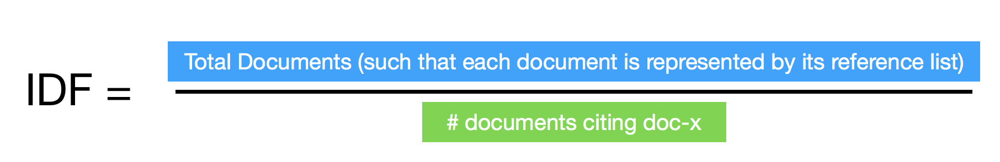

# 6 December 2019

***
## The "CitsToVec" idea 
During the week I talked with Silvio about this new idea/approach i would like to try implement and define more formally.  

1. Starting from the classic TF-IDF definition:
	* **TF (Term Frequency)** measures the frequency of a word in a document.  
_TF = (Number of time the word occurs in the text) / (Total number of words in text)_
	* **IDF (Inverse Document Frequency)** measures the rank of the specific word for its relevancy within the text. Stop words which contain unnecessary information such as “a”, “into” and “and” carry less importance in spite of their occurrence.
_IDF = (Total number of documents / Number of documents with word t in it)_
	* **TF-IDF is the multiplication of TF x IDF.**

2. Let's try yo apply this concept on the Citations case:
	<table>
	<tr> <td> <b>Original TF-IDF </b></td> <td><b>"CitsToVec"</b></td> </tr>
	<tr> <td>Documents</td> <td>Articles</td> </tr>
	<tr> <td>Textual content of the documents</td> <td>The reference list of the articles</td> </tr>
	</table>
	
	* So the **IDF definition** will become: 
	

 	* The **TF definition** can take two options:
 		* The TF value can be equal to 1 or 0, in case the destination article (DOI) is cited/not cited (so is included in the reference list of the article)
 		* considering the equation: *1 / # of total references*

3. **Examples:**  
	We want to analyse how the articles published by “The Lancet” journal change there behaviour regarding the retracted article: “Ileal-lymphoid-nodular Hyperplasia, Non-specific Colitis, and Pervasive Developmental Disorder in Children". In this case the Documents which should be taken in consideration are all "The Lancet" articles from the year of the retracted article publication to our days.

## Retraction analysis last meeting notes

Some important notes from Silvio:

* Since for some of the citations, the reasons are general and don’t include any note about the sentiment. I can add such thing in a separated column, such that the Sentiment value will be: Negative/Neutral/Positive. 

General notes:

* Write an email to "Maria Laurea Viniocchi” asking her wither is it possible to get the full-text of some articles which I am not allowed to get them currently, but this was possible once. Since through the ACNP is possible to see this. (http://acnp.sba.unibo.it/)

## The Retraction analysis
I am still retrieving in listing all the citations of the retracted article:
**“Ileal-lymphoid-nodular Hyperplasia, Non-specific Colitis, and Pervasive Developmental Disorder in Children"**.   
I have currently listed and annotated a total of **175 citing articles**. For each one of these articles I have annotated the following fields:

<table>
	<tr> <td>Date(the year of publication)</td><td> DOI</td><td> Source</td><td> Title</td><td> Abstract</td><td> Section</td><td> Citations to retracted article</td><td> Citing reasons</td><td> Sentiment (negative/neutral/positive)</td><td> Notes</td>  </tr>
</table>

