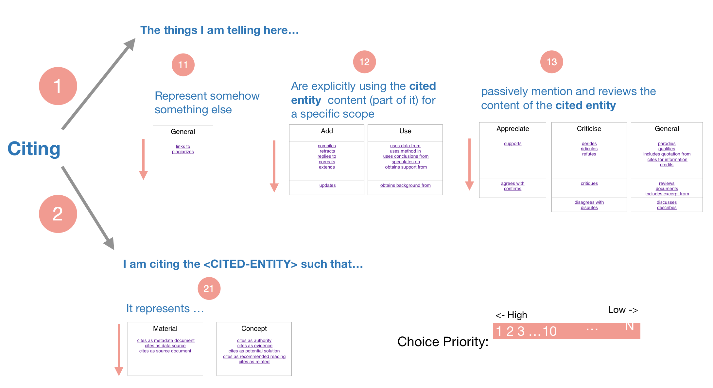

# 6 December 2019

***
## Citations analysis on the anti-vaccines article 
I have finally collected and extracted the textual context of **all the citations pointers occurrences inside the articles after the retraction year (2010)**. Almost half of the articles have been fully annotated with the "Citation Reason" column, which is the most delicate part of the annotation process.  
Regarding this last delicate point, the "Citation reason" selection, I found myself doing it in a very arbitrary mode, and this choice in many cases have involved a selection between 2 or more CITO properties which could all be applied to the examined case. I think this approach might make things get difficult to explain once the methodology should be explained and documented.  
Therefore, I have decided to try formalise this choice in a schema which I can somehow follow each time I am reading a citation-pointer context and annotating its reason.  
The schema I am presenting here is an attempt to classify CITO properties choice into a Priority map, which I have defined specially for the case I am analysing here (retraction analysis).  

Numbers with low values have higher priority.

**Note: the following graphic is not final, and I would like to have a feedback from Silvio about this approach on our meeting next week**  

### Example:
Lets consider the following citation (taken from the retraction table):   

>"The outcome of the decisions made in infancy impact on health throughout the lifespan. For example, the recent Measles outbreak in unvaccinated UK adolescents may be a consequence of parental decisions made after the 1998 Measles, Mumps and Rubella (MMR) controversy caused by **Wakefield et al. (1998)**, that resulted in a 10 per cent drop in immunisation rates (Wise, 2013). Although MMR uptake is currently higher than it was in 1998 (91.2% vs 88.3%; The Health and Social Care Information Centre, Screening and Immunisations Team, 2012), this example demonstrates the influence of parental beliefs on decision outcomes. Parents who are concerned about vaccine safety may leave their child unvaccinated (Tickner et al., 2007), whereas those who believe in the protective benefits of immunisation may make pro-vaccination decisions (Benin et al., 2006; Heininger, 2006; Tickner et al., 2007)."  

In this case the author is explicitly saying some facts and to confirm his conclusions he is citing **Wakefield et al. (1998)**. Following the logical schema:

1. I am citing
2. I am telling and writing some facts before citing -> Priority - 1 -
3. I am not explicitly using the content (any material) from the cited entity; Rather I am just mentioning it in a passive way -> Priority - 13 -
4. Starting from the first cell, I will look if there is any suitable option: In this case **"qualifies"** and **"credits"** might be the most applicable options. 

**Note: in this case the author sentiment is also neutral (since we can't formally say for certain that the consequences are bad or not in the author view)** 
   