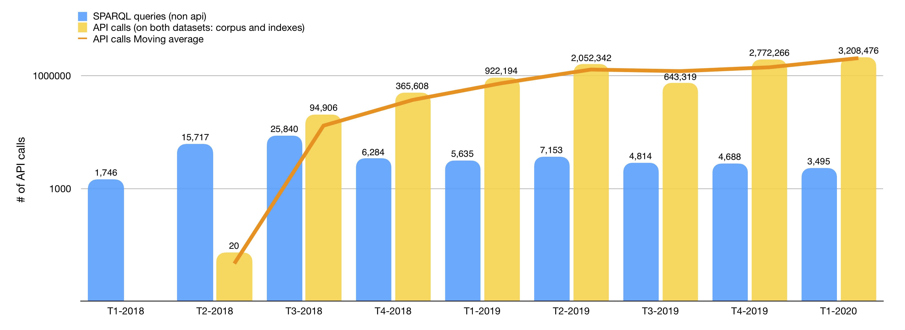
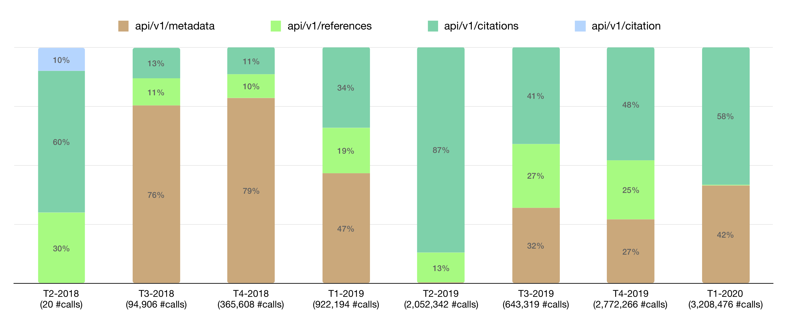

# 27 March 2020
## RAMOSE paper for ISWC-2020
I have finished the last parts of the RAMOSE paper. The last things I have worked on are the quantitative and qualitative analysis. I used the OpenCitations log-files provided by Silvio to create two plots: 

## Some statistics regarding the OCDM
For the OCDM paper, Marilena asked me to do some statistics regarding the OCDM access via the OpenCitations website. I have generated some CSV files, which might be summarised with 2 numbers:  

1. **13844** total number of accesses to the "opencitations.net/model” page (from January 2018 to February 2020).
2. **8202** different users have accessed the "opencitations.net/model” (from January 2018 to February 2020)