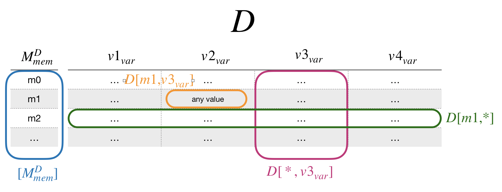

# 17 April 2020
## In-text citations annotation methodology
I have finalised the methodology definition on “protocols.io” ([https://www.protocols.io/](https://www.protocols.io/)), before publishing it, I will wait for a feedback/revision of Silvio.  
The last main changes I have done are summarised in the following points:

* There is a dedicated Git repository at [https://github.com/ivanhb/intext-cits-ret-method](https://github.com/ivanhb/intext-cits-ret-method) which contains all the documents, scripts, images, and general files of the methodology. Some of the files are already included in the protocol.io document.
* The scripts used in the methodology are Python-based. Before starting, there is a brief description on how to correctly prepare and be ready for executing them during the methodology steps. Users can decide whether using a pure .py script or a .ipynb script. Both the scripts are also uploaded on the Git repository, respectively at [https://github.com/ivanhb/intext-cits-ret-method/blob/master/script/method.py](https://github.com/ivanhb/intext-cits-ret-method/blob/master/script/method.py), and [https://nbviewer.jupyter.org/github/ivanhb/intext-cits-ret-method/blob/master/script/method.ipynb](https://nbviewer.jupyter.org/github/ivanhb/intext-cits-ret-method/blob/master/script/method.ipynb).
* Step-5 of the methodology describes the annotation of the in-text citation intent. The description in protocols.io shows the graphical diagram and the algorithm used, but I decided to link it to a further external documentation which describes it with more details using a real in-text citation case. This documentation is included in the Git repository at: [https://ivanhb.github.io/intext-cits-ret-method/doc/cito_model.html](https://ivanhb.github.io/intext-cits-ret-method/doc/cito_model.html).
* The protocols.io methodology uses some common expressions to indicate the dataset and its parts following the glossary summarised in this image. This glossary is described in details before starting the methodology.  
* Finally, I have designed a logo for this methodology, which is also included in the first page of the protocols.io document.  

 
